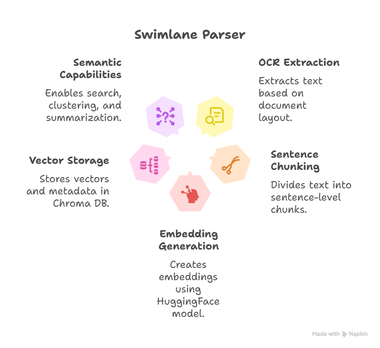

### 🔍 Purpose:
- Extract text from an image (swimlane diagram), split it into sentences, generate sentence embeddings using a transformer model, and store them in a Chroma vector database for retrieval.
- To analyze images in a folder using the Ollama vision-language model (minicpm-v) and save the generated responses to a text file.

### ✅ Step-by-Step Summary:
Setup:

Imports ollama and os modules.

Sets the input image directory: aurus\input.

Chooses a vision model: "minicpm-v".

Loop Through Files:

Scans all entries in the specified directory.

For each file:

Prints its path.

Sends the image path as a prompt to the ollama.generate() function, asking: "What's in this image?"

Prints the model’s response.

### Output Handling:

Writes the model's response to:
"aurus\output\olama_output_minicpm-v.txt" (overwrites each time).

Includes commented-out code for appending instead of overwriting.
-----------------------------------------------------------------------------------------------------------------------

# 🧠 OCR Embedding Pipeline with Docling + Chroma

This project extracts text from flowchart or document images using [Docling](https://github.com/docling-ai/docling), chunks the text into semantically meaningful units, generates embeddings using a HuggingFace transformer model, and stores the results in [Chroma DB](https://www.trychroma.com/) for fast semantic search and retrieval.

---

## 🚀 Features

- ✅ Layout-aware OCR extraction via Docling
- ✂️ Sentence-level chunking using NLTK
- 🧠 Embedding generation using HuggingFace (`all-MiniLM-L6-v2`)
- 🗃️ Vector storage and metadata tagging in Chroma DB
- 🔍 Ready for semantic search, clustering, or summarization

---

## 📦 Installation

docling==0.1.5          # Layout-aware OCR extraction
chromadb==0.4.24        # Vector DB for semantic search
nltk==3.8.1             # Sentence tokenization
transformers==4.41.1    # HuggingFace model loading
torch==2.3.0            # Required for transformer inference

### Import Libraries:

Handles file paths, document conversion, Chroma DB, NLTK for NLP, HuggingFace transformers, and PyTorch.

### Download Tokenizer Data:

Downloads punkt tokenizer from NLTK (note: punkt_tab is unnecessary and doesn't exist, may raise an error).

### OCR Extraction:

Uses Docling's DocumentConverter to extract text from an image: aurus\input\diagram1.png.

### Text Processing:

Joins non-empty OCR lines into a single string.

Splits the combined text into individual sentences (chunks).

### Embedding with Transformers:

Loads the all-MiniLM-L6-v2 embedding model from HuggingFace.

Defines a function to compute mean-pooled sentence embeddings using the model.

### Embedding Generation:

Computes embeddings for each sentence chunk.

### Chroma DB Setup:

Initializes a Chroma client and creates (or accesses) a collection named "ocr_documents".

### Data Insertion into Chroma:

Inserts the sentence chunks with their embeddings and metadata (like chunk index and source).

### Validation:

Retrieves and prints the first stored chunk to confirm successful storage.

### Output Writing:

Writes the retrieved chunk to a text file: aurus\output\ocr_output.txt.

### 📌 Key Technologies Used:
Docling: OCR document conversion.

nltk: Sentence tokenization.

transformers (HuggingFace): Embedding model.

ChromaDB: Vector storage and retrieval.

PyTorch: Inference backend.

### 📌 Key Notes:
Uses Ollama to run vision-language models locally.

The minicpm-v model is designed for image understanding.

Only one response is saved (from the last file), unless the append mode is used.

## Models:

| Model                  | Swimlane/Flowchart Interpretation                                                   | OCR Accuracy | Contextual Reasoning | Latency (Inference Speed) | Recommended Use Case                                                            |
| ---------------------- | ----------------------------------------------------------------------------------- | ------------ | -------------------- | ------------------------- | ------------------------------------------------------------------------------- |
| **Gemma 3**            | High – good structural parsing and context linking                                  | High         | High                 | Medium                    | Balanced choice for general-purpose diagram + text understanding                |
| **LLaVA**              | Medium – strong at descriptive Q\&A but less specialized for structural layouts     | Medium       | High                 | Medium                    | Visual reasoning tasks where detailed explanations are required                 |
| **MiniCPM-V**          | High – optimized OCR and diagram reading, even on-device                            | Very High    | High                 | Very Low                  | Mobile/edge deployment for high-speed diagram text extraction                   |
| **Llama 3.2-Vision**   | High – excels at integrating text + visual context in reasoning                     | High         | Very High            | Medium-High               | Complex multi-step reasoning over diagrams and related text                     |
| **BakLLaVA**           | Medium – solid multimodal pipeline, but less optimized for fine-grained diagram OCR | Medium       | Medium-High          | Medium                    | General multimodal image-to-text workflows                                      |
| **Granite 3.2-Vision** | Very High – specialized for document/diagram parsing                                | High         | High                 | Medium                    | Enterprise workflows requiring structured data extraction from complex diagrams |

## References:

ollama.com
chat.mistral.ai
https://openwebui.com/
https://yunhefeng.me/material/GenFlowchart.pdf
https://huggingface.co/docs/transformers/en/model_doc/pix2struct#transformers.Pix2StructProcessor